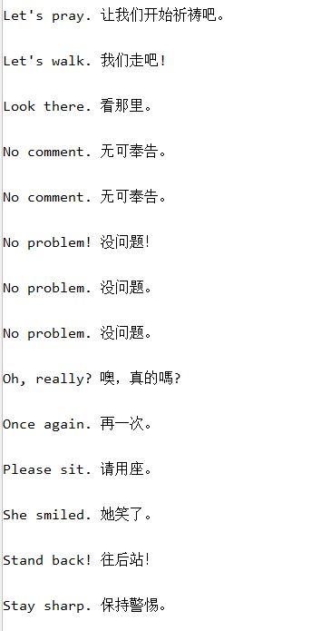
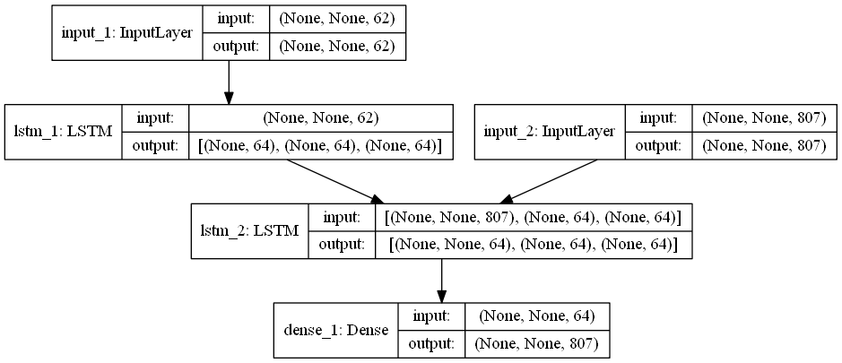
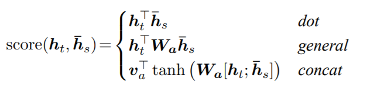

## seq2seq

- utils.py：数据处理
- Seq2Seq.py：训练模型
- Seq2Seq_Attention.py：加入 attention

训练结果：

模型：

- seq2seq：

- seq2seq with attention:

  

[attention paper](https://arxiv.org/pdf/1508.04025.pdf)

仅实现了第一种 dot